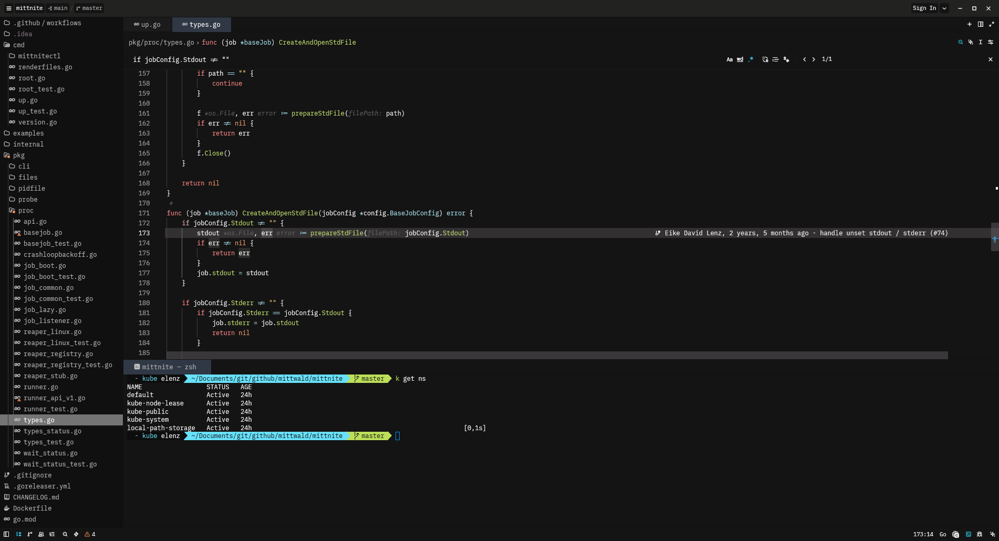

# zed configuration & theme

zed configuration file & theme (based on [filipjanevski/zed-theme](https://github.com/filipjanevski/zed-theme))

theme also available on [zed-themes.com](https://zed-themes.com/themes/LyeEqcv0GHSuoIuTELaRI?name=0x970%20Theme)

